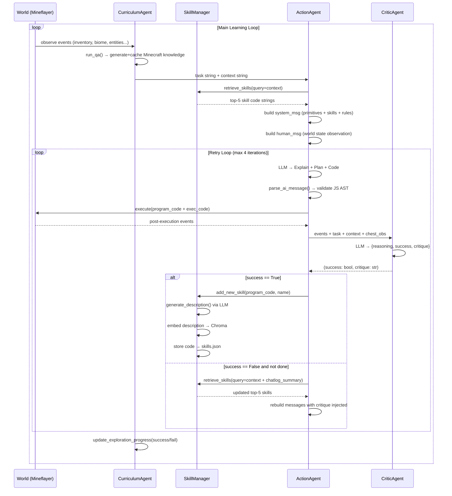

# Voyager Cognitive Architecture: Full Reverse-Engineering Blueprint

> **Source files analyzed:** `voyager/agents/{action,critic,curriculum,skill}.py` · `voyager/prompts/*.txt` · `voyager/voyager.py` · `skill_library/trial1/skill/skills.json`

---

## Table of Contents
1. [System Overview & Agent Topology](#1-system-overview--agent-topology)
2. [Pillar 1 — Prompting Framework & State Representation](#2-pillar-1--prompting-framework--state-representation)
3. [Pillar 2 — Curriculum & Iterative Control Loop](#3-pillar-2--curriculum--iterative-control-loop)
4. [Pillar 3 — Skill Library & Vector Database](#4-pillar-3--skill-library--vector-database)
5. [End-to-End Data Flow](#5-end-to-end-data-flow)
6. [Key Design Invariants & Anti-Hallucination Rules](#6-key-design-invariants--anti-hallucination-rules)

---

## 1. System Overview & Agent Topology

Voyager is a four-agent loop operating inside a live Minecraft environment via Mineflayer. Each agent is a **separate ChatOpenAI call** with its own system prompt, temperature, and LLM tier.

```
┌──────────────────────────────────────────────────────────┐
│                    Voyager.learn()                       │
│                                                          │
│  ┌─────────────┐    task+context    ┌──────────────┐    │
│  │  Curriculum │ ───────────────►  │    Action    │    │
│  │   Agent     │                   │    Agent     │    │
│  │  (GPT-4)    │ ◄─── success? ─── │   (GPT-4)    │    │
│  └─────────────┘                   └──────┬───────┘    │
│         ▲                                 │ JS code     │
│         │ update progress                 ▼             │
│  ┌──────┴──────┐   success/critique  ┌──────────────┐  │
│  │   Skill     │ ◄───────────────── │    Critic    │  │
│  │  Manager    │                    │    Agent     │  │
│  │ (GPT-3.5)   │                    │   (GPT-4)    │  │
│  └─────────────┘                    └──────────────┘  │
│         │ top-k skills (retrieved)                     │
│         └──────────────► injected into Action system   │
└──────────────────────────────────────────────────────────┘
```

**Model assignments (defaults in `voyager.py`):**

| Agent | Default Model | Temperature |
|---|---|---|
| ActionAgent | `gpt-4` | 0 |
| CurriculumAgent (main) | `gpt-4` | 0 |
| CurriculumAgent (QA) | `gpt-3.5-turbo` | 0 |
| CriticAgent | `gpt-4` | 0 |
| SkillManager | `gpt-3.5-turbo` | 0 |

---

## 2. Pillar 1 — Prompting Framework & State Representation

### 2.1 Physical World → Text: The Observation Schema

The `ActionAgent.render_human_message()` ([action.py L102–L199](file:///c:/Users/maver/projects/Voyager/voyager/agents/action.py#L102-L199)) assembles the observation string from raw Mineflayer event data. The **exact template** is:

```
Code from the last round: <JS code string | "No code in the first round">

Execution error: <error string | "No error">

Chat log: <onChat messages joined by \n | "None">

Biome: <biome string>

Time: <timeOfDay string>

Nearby blocks: <comma-joined voxel names | "None">

Nearby entities (nearest to farthest): <entities sorted by distance, comma-joined | "None">

Health: <float:.1f>/20

Hunger: <float:.1f>/20

Position: x=<float:.1f>, y=<float:.1f>, z=<float:.1f>

Equipment: <equipment list>

Inventory (<used>/36): <{item: count} dict | "Empty">

Chests:
<position>: <{item: count} | "Empty" | "Unknown items inside">
...
(or "Chests: None" if chest_memory is empty, omitted for deposit tasks)

Task: <task string>

Context: <context string | "None">

Critique: <critique string from CriticAgent | "None">
```

**Raw field origins from the Mineflayer `observe` event:**

```json
{
  "status": {
    "biome":         "plains",
    "timeOfDay":     "day",
    "health":        20.0,
    "food":          20.0,
    "position":      { "x": 12.5, "y": 64.0, "z": -87.3 },
    "equipment":     ["iron_pickaxe", null, null, null, null, null],
    "inventoryUsed": 7,
    "entities":      { "creeper": 4.2, "pig": 15.7 }
  },
  "voxels":       ["grass_block", "dirt", "oak_log", "stone"],
  "inventory":    { "oak_log": 3, "stone_pickaxe": 1 },
  "blockRecords": ["coal_ore", "iron_ore", "gravel"],
  "nearbyChests": { "(12, 64, -90)": { "cobblestone": 10 } }
}
```

> **Critical detail:** Entities are **sorted by ascending distance** before being stringified — the LLM sees `(nearest to farthest)`, which is the exact string. Distance values are stored as floats in `entities` dict and sorted via `sorted(entities.items(), key=lambda x: x[1])`.

> **Biome override:** If none of `dirt | log | grass | sand | snow` appear in `voxels`, the CurriculumAgent **overrides** `biome` → `"underground"` — a heuristic to prevent incorrect task proposals when the bot is caving.

---

### 2.2 ActionAgent System Prompt

**File:** [`voyager/prompts/action_template.txt`](file:///c:/Users/maver/projects/Voyager/voyager/prompts/action_template.txt)

> You are a helpful assistant that writes Mineflayer javascript code to complete any Minecraft task specified by me.
>
> Here are some useful programs written with Mineflayer APIs.
>
> `{programs}`
>
> At each round of conversation, I will give you  
> Code from the last round: ...  
> Execution error: ...  
> Chat log: ...  
> Biome: ...  
> Time: ...  
> Nearby blocks: ...  
> Nearby entities (nearest to farthest):  
> Health: ...  
> Hunger: ...  
> Position: ...  
> Equipment: ...  
> Inventory (xx/36): ...  
> Chests: ...  
> Task: ...  
> Context: ...  
> Critique: ...  
>
> You should then respond to me with  
> **Explain** (if applicable): Are there any steps missing in your plan? Why does the code not complete the task? What does the chat log and execution error imply?  
> **Plan:** How to complete the task step by step. You should pay attention to Inventory since it tells what you have. The task completeness check is also based on your final inventory.  
> **Code:**
> 1. Write an async function taking the bot as the only argument.
> 2. Reuse the above useful programs as much as possible.
>    - Use `mineBlock(bot, name, count)` to collect blocks. Do not use `bot.dig` directly.
>    - Use `craftItem(bot, name, count)` to craft items. Do not use `bot.craft` or `bot.recipesFor` directly.
>    - Use `smeltItem(bot, name count)` to smelt items. Do not use `bot.openFurnace` directly.
>    - Use `placeItem(bot, name, position)` to place blocks. Do not use `bot.placeBlock` directly.
>    - Use `killMob(bot, name, timeout)` to kill mobs. Do not use `bot.attack` directly.
> 3. Your function will be reused for building more complex functions. Therefore, you should make it generic and reusable. You should not make strong assumption about the inventory (as it may be changed at a later time), and therefore you should always check whether you have the required items before using them. If not, you should first collect the required items and reuse the above useful programs.
> 4. Functions in the "Code from the last round" section will not be saved or executed. Do not reuse functions listed there.
> 5. Anything defined outside a function will be ignored, define all your variables inside your functions.
> 6. Call `bot.chat` to show the intermediate progress.
> 7. Use `exploreUntil(bot, direction, maxDistance, callback)` when you cannot find something. You should frequently call this before mining blocks or killing mobs. You should select a direction at random every time instead of constantly using (1, 0, 1).
> 8. `maxDistance` should always be 32 for `bot.findBlocks` and `bot.findBlock`. Do not cheat.
> 9. Do not write infinite loops or recursive functions.
> 10. Do not use `bot.on` or `bot.once` to register event listeners. You definitely do not need them.
> 11. Name your function in a meaningful way (can infer the task from the name).

**Required response format** ([`action_response_format.txt`](file:///c:/Users/maver/projects/Voyager/voyager/prompts/action_response_format.txt)):

```
Explain: ...
Plan:
1) ...
2) ...
3) ...
...
Code:
```javascript
// helper functions (only if needed, try to avoid them)
...
// main function after the helper functions
async function yourMainFunctionName(bot) {
  // ...
}
```
```

**The `{programs}` slot** is populated by concatenating:
1. The **hardcoded base primitives** (JS source of `exploreUntil`, `mineBlock`, `craftItem`, `placeItem`, `smeltItem`, `killMob` — and `useChest`/`mineflayer` for non-3.5 models)
2. The **top-k retrieved skill code strings** from the SkillManager vector DB

---

### 2.3 Anti-Hallucination Rules in ActionAgent

The system enforces several explicit structural constraints:

| Rule | Mechanism |
|---|---|
| No raw Mineflayer API calls | Rules 2a-2e ban `bot.dig`, `bot.craft`, `bot.openFurnace`, `bot.placeBlock`, `bot.attack` directly |
| No global scope variables | Rule 5: "Anything defined outside a function will be ignored" |
| No infinite loops | Rule 9 explicit ban |
| No event listeners | Rule 10 explicit ban |
| `maxDistance` cap | Rule 8: hardcoded to 32 to prevent searching out-of-range |
| Inventory pre-checks required | Rule 3: "check whether you have the required items before using them" |
| Code validity enforced post-generation | `process_ai_message()` parses with `@babel/core`, asserts function signatures, retries 3× on parse failure |
| Main function must be `async` | Asserted at parse time; `exec_code = f"await {main_function['name']}(bot);"` |
| Main function must take exactly `bot` | Asserted: `len(main_function["params"]) == 1 and main_function["params"][0].name == "bot"` |

---

### 2.4 CriticAgent System Prompt

**File:** [`voyager/prompts/critic.txt`](file:///c:/Users/maver/projects/Voyager/voyager/prompts/critic.txt)

> You are an assistant that assesses my progress of playing Minecraft and provides useful guidance.
>
> You are required to evaluate if I have met the task requirements. Exceeding the task requirements is also considered a success while failing to meet them requires you to provide critique to help me improve.
>
> I will give you the following information:
>
> Biome: The biome after the task execution.  
> Time: The current time.  
> Nearby blocks: The surrounding blocks. These blocks are not collected yet. However, this is useful for some placing or planting tasks.  
> Health: My current health.  
> Hunger: My current hunger level. For eating task, if my hunger level is 20.0, then I successfully ate the food.  
> Position: My current position.  
> Equipment: My final equipment. For crafting tasks, I sometimes equip the crafted item.  
> Inventory (xx/36): My final inventory. For mining and smelting tasks, you only need to check inventory.  
> Chests: If the task requires me to place items in a chest, you can find chest information here.  
> Task: The objective I need to accomplish.  
> Context: The context of the task.

**Critic Output Schema** (strict JSON):

```json
{
  "reasoning": "string — chain-of-thought explaining the judgment",
  "success":   true | false,
  "critique":  "string — actionable correction if failed, empty string if success"
}
```

> **Parsing:** The Critic response is parsed with `fix_and_parse_json()` and retried up to **5 times** on failure. If all retries fail, it returns `(False, "")` — a conservative failure signal.

> **Short-circuit:** If any `onError` event is detected in the post-execution event stream, the Critic returns `None` immediately (no LLM call), and the main loop treats this as a parse failure.

---

## 3. Pillar 2 — Curriculum & Iterative Control Loop

### 3.1 CurriculumAgent Decision Logic

**File:** [`voyager/agents/curriculum.py`](file:///c:/Users/maver/projects/Voyager/voyager/agents/curriculum.py)

The `propose_next_task()` method follows a **hierarchical decision tree** before ever calling the LLM:

```
propose_next_task()
│
├─ IF progress == 0
│   └─ HARDCODE: "Mine 1 wood log"
│       context: "You can mine one of oak, birch, spruce, jungle, acacia,
│                 dark oak, or mangrove logs."
│
├─ ELSE IF inventoryUsed >= 33  (inventory almost full)
│   ├─ IF known chest with Unknown/Empty contents exists
│   │   └─ HARDCODE: "Deposit useless items into the chest at {position}"
│   ├─ ELSE IF has "chest" in inventory
│   │   └─ HARDCODE: "Place a chest"
│   └─ ELSE
│       └─ HARDCODE: "Craft 1 chest"
│
└─ ELSE → call LLM (propose_next_ai_task)
    ├─ render_system_message()   ← loads curriculum.txt
    └─ render_human_message()    ← assembled observation + QA context
```

### 3.2 The Warm-Up System

Before including an observation field in the curriculum prompt, a **warm-up threshold** is checked: the field is **only included** once `self.progress >= self.warm_up[key]`. This prevents overwhelming early prompts.

**Default warm-up thresholds** (tasks completed before field is revealed):

```json
{
  "context":                15,
  "biome":                  10,
  "time":                   15,
  "nearby_blocks":           0,
  "other_blocks":           10,
  "nearby_entities":         5,
  "health":                 15,
  "hunger":                 15,
  "position":                0,
  "equipment":               0,
  "inventory":               0,
  "optional_inventory_items": 7,
  "chests":                  0,
  "completed_tasks":         0,
  "failed_tasks":            0
}
```

Fields with `warm_up > 0` are also subject to **random 20% dropout** (`random.random() < 0.8`) to add diversity to the prompt.

**Inventory warm-up filter:** Before reaching `optional_inventory_items = 7` tasks, the inventory is filtered to only show **core items** matching:
```
.*_log|.*_planks|stick|crafting_table|furnace|cobblestone|dirt|coal|.*_pickaxe|.*_sword|.*_axe
```

### 3.3 CurriculumAgent Input Variables

The **full observation dict** passed to the curriculum prompt:

```json
{
  "context":          "Question 1: ...\nAnswer: ...\n...",
  "biome":            "Biome: plains\n\n",
  "time":             "Time: day\n\n",
  "nearby_blocks":    "Nearby blocks: grass_block, dirt, oak_log\n\n",
  "other_blocks":     "Other blocks that are recently seen: coal_ore, iron_ore\n\n",
  "nearby_entities":  "Nearby entities: pig, creeper\n\n",
  "health":           "Health: 20.0/20\n\n",
  "hunger":           "Hunger: 20.0/20\n\n",
  "position":         "Position: x=12.5, y=64.0, z=-87.3\n\n",
  "equipment":        "Equipment: ['iron_pickaxe', null, null, null, null, null]\n\n",
  "inventory":        "Inventory (7/36): {'oak_log': 3, 'stone_pickaxe': 1}\n\n",
  "chests":           "Chests:\n(12, 64, -90): {'cobblestone': 10}\n\n",
  "completed_tasks":  "Completed tasks so far: Mine 1 wood log, Craft a wooden pickaxe\n\n",
  "failed_tasks":     "Failed tasks that are too hard: Mine 5 diamond ore\n\n"
}
```

### 3.4 CurriculumAgent System Prompt

**File:** [`voyager/prompts/curriculum.txt`](file:///c:/Users/maver/projects/Voyager/voyager/prompts/curriculum.txt)

> You are a helpful assistant that tells me the next immediate task to do in Minecraft. My ultimate goal is to discover as many diverse things as possible, accomplish as many diverse tasks as possible and become the best Minecraft player in the world.
>
> **Criteria:**
> 1. Act as a mentor and guide me to the next task based on my current learning progress.
> 2. Be very specific about what resources to collect, what to craft, or what mobs to kill.
> 3. The next task must follow a concise format: "Mine [qty] [block]", "Craft [qty] [item]", "Smelt [qty] [item]", "Kill [qty] [mob]", "Cook [qty] [food]", "Equip [item]". It must be a **single phrase**.
> 4. The next task should not be too hard since I may not have the necessary resources yet.
> 5. The next task should be **novel and interesting**. Look for rare resources, upgrade equipment, discover new things. Do not repeat.
> 6. Only repeat tasks if necessary to collect more resources.
> 7. Do not ask me to build or dig shelter even if it's night. Explore the world.
> 8. Avoid tasks requiring visual confirmation (placing torches, digging holes). Do not propose tasks starting with: Placing, Building, Planting, Trading.
>
> **Response format:**
> ```
> Reasoning: Based on the information I listed above, do reasoning about what the next task should be.
> Task: The next task.
> ```

**Curriculum output parsing** (`parse_ai_message()`):
```python
for line in message.split("\n"):
    if line.startswith("Task:"):
        task = line[5:].replace(".", "").strip()
```
The task string is extracted via simple prefix matching, then periods are stripped.

---

### 3.5 The Two-Phase QA Context System

Before generating a task proposal (after `progress >= 15`), the CurriculumAgent runs a **two-phase QA pipeline** to enrich its context with Minecraft-domain knowledge:

#### Phase 1 — Question Generation ([`curriculum_qa_step1_ask_questions.txt`](file:///c:/Users/maver/projects/Voyager/voyager/prompts/curriculum_qa_step1_ask_questions.txt))

The QA LLM (GPT-3.5-turbo) generates 5–10 specific questions about the current state, seeded with 3 hardcoded biome questions:

```python
# Hardcoded seeds (always included):
questions = [
    f"What are the blocks that I can find in the {biome} in Minecraft?",
    f"What are the items that I can find in the {biome} in Minecraft?",
    f"What are the mobs that I can find in the {biome} in Minecraft?",
]
# Plus LLM-generated questions in format:
# Question N: <question text>
# Concept N: <concept name>
```

Phase 1 prompt instructs the LLM to generate **self-contained, specific questions** (not referencing player state). Questions that are too general are explicitly rejected via examples.

#### Phase 2 — Answer Generation ([`curriculum_qa_step2_answer_questions.txt`](file:///c:/Users/maver/projects/Voyager/voyager/prompts/curriculum_qa_step2_answer_questions.txt))

> You are a helpful assistant that answers my question about Minecraft.
>
> I will give you the following information:  
> Question: ...
>
> You will answer the question based on the context (only if available and helpful) and your own knowledge of Minecraft.
> 1. Start your answer with "Answer: ".
> 2. Answer "Answer: Unknown" if you don't know the answer.

**QA Caching:** Answers are cached in a **Chroma vector DB** (`qa_cache_questions_vectordb`). Before calling the LLM, a similarity search is run with threshold `score < 0.05` — if a semantically near-identical question exists, its cached answer is reused. "Unknown" answers and "language model" phrases are filtered out and never injected into context.

---

### 3.6 Failure Feedback Loop: What Gets Passed Back

When a task fails and is retried, the `ActionAgent.render_human_message()` receives the **full post-execution state** plus:

| Field | What It Contains |
|---|---|
| `code` | The exact JS code that was generated last round |
| `error_messages` | All `onError` events from the Mineflayer execution |
| `chat_messages` | All `onChat` messages (bot's `bot.chat()` calls — progress logs) |
| `critique` | The CriticAgent's `critique` string (actionable text) |
| `events` | Full current world state (health, inventory, etc.) |

The critique is written back into the observation as:
```
Critique: Craft a wooden pickaxe with a crafting table using 3 spruce planks and 2 sticks.
```

This creates a closed correction loop: **Observe → Code → Execute → Critique → Re-observe → Re-code**.

**Task failure persistence:** If a task exceeds `action_agent_task_max_retries = 4`, it's logged to `failed_tasks` (persisted to JSON) and the curriculum moves on. Failed tasks appear in subsequent curriculum prompts, signaling the LLM to avoid proposing them again.

---

## 4. Pillar 3 — Skill Library & Vector Database

### 4.1 Skill Data Schema

**File:** [`skill_library/trial1/skill/skills.json`](file:///c:/Users/maver/projects/Voyager/skill_library/trial1/skill/skills.json)

Each skill is a key-value entry in `skills.json`. The key is the **function name**; the value contains exactly two fields:

```json
{
  "<functionName>": {
    "code": "<full async function source as string>",
    "description": "<wrapped description as a function stub>"
  }
}
```

**Concrete example from the actual library:**

```json
{
  "craftWoodenPickaxe": {
    "code": "async function craftWoodenPickaxe(bot) {\n  // Check if crafting table is in the inventory\n  const craftingTableCount = bot.inventory.count(\n    mcData.itemsByName.crafting_table.id\n  );\n  // If not, craft a crafting table\n  if (craftingTableCount === 0) {\n    await craftCraftingTable(bot);\n  }\n  // ... rest of implementation\n  await craftItem(bot, 'wooden_pickaxe', 1);\n  bot.chat('Crafted a wooden pickaxe.');\n}",
    "description": "async function craftWoodenPickaxe(bot) {\n    // The function crafts a wooden pickaxe using oak planks, sticks, and a crafting table. It checks if there are enough oak planks and sticks in the inventory, and crafts them if necessary. Then, it places a crafting table near the bot and uses it to craft a wooden pickaxe.\n}"
  }
}
```

> **Critical architectural point:** The **`description` field** is what gets **embedded and indexed** in the vector database. The **`code` field** is what gets **injected into the context window** at retrieval time. They serve entirely separate roles.

**On-disk persistence (3 stores, all synced):**

```
ckpt/skill/
├── skills.json              ← master index {name: {code, description}}
├── code/
│   ├── craftWoodenPickaxe.js   ← raw JS source
│   └── craftWoodenPickaxeV2.js ← versioned on rewrite
├── description/
│   ├── craftWoodenPickaxe.txt  ← description text
│   └── ...
└── vectordb/                ← Chroma persistent store
```

---

### 4.2 Skill Ingestion: From Success to Library Entry

When `info["success"] == True` in the main loop ([`voyager.py` L353–L354](file:///c:/Users/maver/projects/Voyager/voyager/voyager.py#L353-L354)):

```python
if info["success"]:
    self.skill_manager.add_new_skill(info)
```

`info` dict passed to `add_new_skill()`:

```json
{
  "task":         "Craft a wooden pickaxe",
  "success":      true,
  "program_code": "async function craftWoodenPickaxe(bot) { ... }",
  "program_name": "craftWoodenPickaxe",
  "conversations": [...]
}
```

**The `add_new_skill()` pipeline** ([`skill.py` L61–L100](file:///c:/Users/maver/projects/Voyager/voyager/agents/skill.py#L61-L100)):

```
1. generate_skill_description(program_name, program_code)
   → LLM call (GPT-3.5-turbo) with skill.txt system prompt
   → Returns: natural-language prose description (≤6 sentences)
   → Wrapped into: "async function {name}(bot) {\n    // {description}\n}"

2. vectordb.add_texts(texts=[description], ids=[program_name], metadatas=[{"name": name}])
   → description string embedded via OpenAIEmbeddings
   → stored in Chroma with program_name as document ID

3. skills[program_name] = {"code": program_code, "description": description}

4. Persist to disk: code/*.js, description/*.txt, skills.json, vectordb/
```

**Versioning on overwrite:** If a skill name already exists (the agent solved the same task again), the old vector embedding is deleted, the new description is re-indexed under the same ID, but the old code is preserved on disk as `{name}V{i}.js`.

---

### 4.3 Skill Description Generation Prompt

**File:** [`voyager/prompts/skill.txt`](file:///c:/Users/maver/projects/Voyager/voyager/prompts/skill.txt)

> You are a helpful assistant that writes a description of the given function written in Mineflayer javascript code.
>
> 1. Do not mention the function name.
> 2. Do not mention anything about `bot.chat` or helper functions.
> 3. There might be some helper functions before the main function, but you only need to describe the main function.
> 4. Try to summarize the function in no more than 6 sentences.
> 5. Your response should be a **single line of text**.

Human message format: `{program_code}\n\nThe main function is \`{program_name}\`.`

---

### 4.4 Skill Retrieval: The Exact Query Mechanism

**At task start** (`reset()` in `voyager.py`):
```python
skills = self.skill_manager.retrieve_skills(query=self.context)
```
The **query is the `context` string** — which is the QA-generated answer about how to perform the current task, e.g.:
```
"Question: How to craft a wooden pickaxe in Minecraft?
Answer: To craft a wooden pickaxe, you need 3 wood planks and 2 sticks. Place 3 planks across the top row and 2 sticks in the middle column of a crafting table."
```

**After each failed attempt** (`step()` in `voyager.py`):
```python
new_skills = self.skill_manager.retrieve_skills(
    query=self.context + "\n\n" + self.action_agent.summarize_chatlog(events)
)
```
The query is **augmented with the chat log summary** — a distillation of `bot.chat()` messages that indicate missing resources (e.g., `"I also need: a nearby crafting table, 2 sticks."`).

**`retrieve_skills()` implementation** ([`skill.py` L114–L127](file:///c:/Users/maver/projects/Voyager/voyager/agents/skill.py#L114-L127)):
```python
k = min(vectordb._collection.count(), self.retrieval_top_k)  # top_k = 5
docs_and_scores = vectordb.similarity_search_with_score(query, k=k)
# Returns: [(Document(page_content=description, metadata={"name": name}), score), ...]
skills = [self.skills[doc.metadata["name"]]["code"] for doc, _ in docs_and_scores]
```

> **What is embedded at query time:** The raw `query` string (context + optional chat log) is embedded by `OpenAIEmbeddings` and cosine-similarity searched against the description embeddings.

> **What is returned:** The raw **code** strings (not descriptions). Descriptions are only used for indexing.

---

### 4.5 Skill Injection into the Context Window

Retrieved skill code strings are passed to `ActionAgent.render_system_message()`:

```python
programs = "\n\n".join(load_control_primitives_context(base_skills) + skills)
# base_skills = ["exploreUntil", "mineBlock", "craftItem", "placeItem", "smeltItem", "killMob"]
system_message = SystemMessagePromptTemplate.from_template(action_template).format(
    programs=programs,
    response_format=response_format
)
```

The final system message therefore contains:
```
[action_template preamble]

Here are some useful programs written with Mineflayer APIs:

<source of exploreUntil.js>

<source of mineBlock.js>

... (other primitives)

<source of craftWoodenPickaxe from skill library>

<source of mineIronOre from skill library>

... (up to 5 retrieved skills)

[rest of action_template rules]
```

This entire block becomes the **system message** of the conversation. The agent can directly call any of these functions inside its generated code since they are available in the execution runtime via `skill_manager.programs`.

---

## 5. End-to-End Data Flow



---

## 6. Key Design Invariants & Anti-Hallucination Rules

### Structural Integrity
- The `observe` event **must always be the last event** in any event stream. Asserted in both ActionAgent and CriticAgent with `assert events[-1][0] == "observe"`.
- Code is **not extracted from the LLM response** until it passes `@babel/core` AST parsing — malformed JS causes a retry with the same state, never a crash.
- The `exec_code` is always `await {main_function_name}(bot)` — the system extracts the **last async function** as the entry point, preventing stale helper functions from being called.

### Grounding via Control Primitives
All 13 control primitives (`mineBlock`, `craftItem`, `smeltItem`, `placeItem`, `killMob`, `exploreUntil`, `useChest`, etc.) are **always injected** into every action prompt. The LLM is explicitly forbidden from using lower-level Mineflayer APIs directly — every real action must go through these wrappers, which handle pathfinding, error recovery, and event logging internally.

### Soft Failure vs Hard Failure
- **Execution error (`onError` event):** Immediately returns `None` from Critic — treated as critical failure, no LLM critique call.
- **Task failure (success=False):** Critique is generated and injected into next attempt.
- **Parse failure (malformed JS):** Retried up to 3× before returning error string; error string is displayed but the observation is re-used.
- **Curriculum LLM failure:** Retried up to 5× before raising `RuntimeError`.
- **Critic LLM parse failure:** Retried up to 5× before returning conservative `(False, "")`.

### Persistent Memory
| Store | Format | Contents |
|---|---|---|
| `completed_tasks.json` | JSON array of strings | All successfully completed task names |
| `failed_tasks.json` | JSON array of strings | All tasks that hit max retries |
| `qa_cache.json` | JSON dict `{question: answer}` | Cached Minecraft QA pairs |
| `skills.json` | JSON dict `{name: {code, description}}` | All learned skills |
| `chest_memory.json` | JSON dict `{position: {item: count}}` | Observed chest contents |
| `skill/vectordb/` | ChromaDB | Description embeddings |
| `curriculum/vectordb/` | ChromaDB | QA question embeddings |
